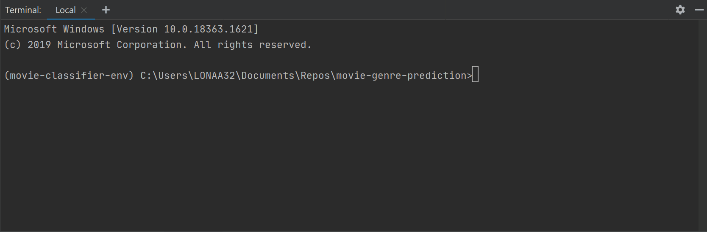

# Movie Genre Classifier

A command-line application that predicts a movie's top genre given its title and
 description.

## Description

The app uses a logistic regression algorithm trained on the
["The Movies Dataset"](https://www.kaggle.com/rounakbanik/the-movies-dataset?select=movies_metadata.csv) 
data from Kaggle to predict the most relevant (i.e. likely) genre of a movie given its title and
description. The dataset consists of movies released on or before July 2017. Data points include 
among other, the movie title and description that are used in this project.

Since a movie can belong to multiple genres, this is a treated as a multi-label classification 
problem. There are 20 genres identified in the dataset and probabilities are returned for each
one. The genre with the highest probability is then returned along with the input title and 
description. The model was tested with unseen movie samples and performs to a satisfactory level. 

#### Design Choices

The project is developed in Python. Jupyter Notebooks, an open-source, interactive web tool was
used to explore the dataset as they help combine code and computational output with explanatory text. 
To develop the prediction model, Scikit-learn, a Python library for machine learning, 
with deliberately limited scope, was preferred as it covers a variety of well-established algorithms.
As part of the exploration phase, a neural network was also explored using Tensorflow, an end-to-end
open source platform for machine learning. Finally Typer, a library for building CLI applications 
was preferred to develop the app because it is easy to use and intuitive to write.

#### Example:

```
Input:

movie classifier.py --title "Tenet" --description "Armed with only one word, Tenet, and 
fighting for the survival of the entire world, a Protagonist journeys through a twilight 
world of international espionage on a mission that will unfold in something beyond real time."

Output:
{
"title": "Tenet",
"description": "Armed with only one word, Tenet, and fighting for the survival of the entire world,
a Protagonist journeys through a twilight world of international espionage on a mission that will
unfold in something beyond real time.",
"genre": "Action"
}
```


## Getting Started

### Dependencies

* Before running the app, you will need to download and install
 [python 3.8](https://www.python.org/downloads/release/python-380/) for your operating system.
 
* To install the packages that are used by the app you will also need to install
 [pip](https://pip.pypa.io/en/stable/installing/) which is a package installer for Python. 
 (pip is already installed in Python 3 >=3.4 downloaded from python.org or if you are 
 working in a Virtual Environment created by virtualenv or venv. Just make sure to upgrade pip.)
* To clone the repo you will need to download and install [git](https://git-scm.com/downloads) for
your operating system or do it through your IDE if supported.  
* For a complete list of all the packages used, refer to the [project
 dependencies](https://github.com/alexandrosanat/movie-genre-prediction/network/dependencies):
    - pandas: used for data manipulation
    - seaborn: used for visualisations  
    - nltk: used for text processing
    - numpy: used for manipulating array objects
    - scikit-learn: used for the classification algorithms
    - tensorflow: used for machine learning algorithms
    - joblib: used to save and load the model
    - typer: used as an alternative to the native argparse to build the CLI
* If you plan to run the app using [Docker](https://docs.docker.com/get-docker/)
 you will also need to install it first.
* If you plan to run or re-train the model you will also need to install
 [jupyter notebooks](https://jupyter.org/install) unless they are supported by your IDE.
 
### Executing program

To run the app in your workspace follow the steps below:

#### Option 1 - using Python

* Open a new terminal 
* Navigate to a folder where you want to clone the repo
* Clone the repo using:
    ```
    git clone https://github.com/alexandrosanat/movie-genre-prediction.git
    ```
* Change Directory into the movie-genre-prediction repo you downloaded
* Create and activate a new
 [virtual environment](https://packaging.python.org/guides/installing-using-pip-and-virtual-environments/).
* Install the required packages by running:
    ```
    pip install -r requirements.txt
    ```
* Run the app using:
    ```
    python movie_classifier.py --title "<title>" -- description "<description>"
    ```
  
 

#### Option 2 - using Docker

* Open a new terminal 
* Pull the build image directly from
   [here](https://hub.docker.com/repository/docker/alexandrosanat/movie-genre-prediction) using:
   ```
   docker pull alexandrosanat/movie-genre-prediction:latest
   ```
* Once the image is downloaded, run the app using:
    ```
    docker run -it --name my_app --rm alexandrosanat/movie-genre-prediction
    ``` 
* Alternatively:
    * Navigate to a folder where you want to clone the repo
    * Clone the repo using:
        ```
        git clone https://github.com/alexandrosanat/movie-genre-prediction.git
        ```
    * Change Directory into the movie-genre-prediction repo you downloaded
    * Build the docker image using:
        ```
        docker build -t movie-genre-prediction --rm .
        ```
    * Once the image is build, run the app using:
        ```
        docker run -it --name my_app --rm movie-genre-prediction
        ```




### Retraining the model

The analysis of the dataset and the model training, evaluation and selection can be found in the
[model_training.ipynb](https://github.com/alexandrosanat/movie-genre-prediction/blob/main/model_training.ipynb)
notebook. 

To retrain the model you will need to install the additional packages required by running:
   ``` 
   pip install -r requirements-model-training.txt
   ```

## Help

To get help on the how to run the app or the available options type:

   ``` 
   python movie_classifier.py --help
   ``` 


## To-Do

- [ ] Add Logging
- [ ] Add Option for user to select probability threshold
- [ ] Add Option for user to select number of genres to return
- [ ] Add Option for user to pass multiple movies and descriptions at once
- [ ] Model training
    - [ ] Try different vectorisers
- [ ] Improve app performance
- [ ] Write additional tests to cover more use cases


## Authors

- Alex Anatolakis

## Version History

* 0.1 - Initial Release

## Acknowledgments

* [Predicting Movie Genres using NLP](https://www.analyticsvidhya.com/blog/2019/04/predicting-movie-genres-nlp-multi-label-classification/)

## License

* [MIT License](https://github.com/alexandrosanat/movie-genre-prediction/blob/main/LICENSE)

